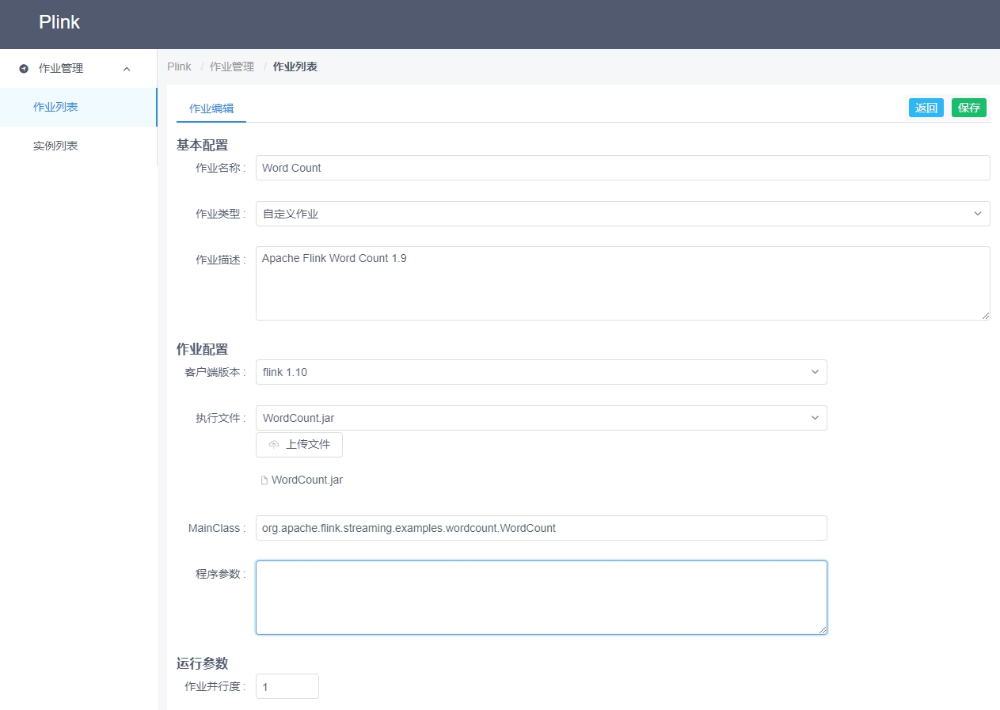

# 运行 Word Count 作业
在 Plink 上提交 Flink 自带的 flink-1.9.1\examples\streaming\WordCount.jar，然运行。

## 作业列表
### 新建作业
* 作业管理 -> 作业列表 -> 右侧按钮 -> 新建 -> 输入（作业名称/类型/描述） -> 新建。如下所示:

### 编辑作业
* 作业列表编辑或新建作业之后会自动跳转到编辑作业的页面。填写参数，上传 Jar，保存即可。如下所示:
> 这里的 Jar 使用的是 Flink 官方自带的 flink-1.9.1-bin-scala_2.11\flink-1.9.1\examples\streaming\WordCount.jar。  
> 下载链接: <https://mirror.bit.edu.cn/apache/flink/flink-1.9.3/flink-1.9.3-bin-scala_2.11.tgz>

### 作业详情
1. 作业信息

    确认自己作业的基础信息，作业配置，运行参数等。
    

2. 作业实例
    
    每一次作业运行时，都会产生一个作业实例。

3. 作业监控
    
    未实现 。。。

#### 启动作业
在作业详情页的右侧功能按钮点击启动，即可启动作业，同时页面会自动刷新（当前刷新频率为 1s）

1. 待启动
    
2. 启动中
    
3. 运行中
    
4. 运行成功
    

## 实例列表
实例列表可以看所有的作业实例运行历史信息。

